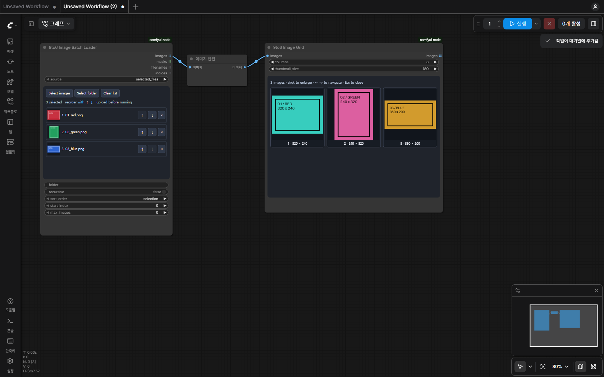

# Image Batch Loader & Image Grid

여러 이미지를 선택하거나 폴더 전체를 읽고, 중간 처리 결과를 마지막 노드에서 한눈에 확인합니다.

```text
9to6 Image Batch Loader → 이미지 처리 노드 → 이미지 처리 노드 → 9to6 Image Grid
```



[클릭 확대 화면 보기](examples/screenshots/lightbox.png)

## 1. 이미지 불러오기

**9to6 Image Batch Loader**를 추가합니다.

### 파일 다중 선택 / 폴더 업로드

- `Select images`: 현재 브라우저를 사용하는 PC에서 여러 이미지 파일을 선택합니다.
- `Select folder`: 현재 PC의 폴더와 하위 폴더에 있는 지원 이미지 파일을 업로드합니다.
- 업로드한 파일은 ComfyUI의 `input/9to6-images/` 아래에 보관합니다. 업로드가 끝나면 `source`가 `selected_files`로 설정됩니다.
- 선택 목록에서 ↑ / ↓로 순서를 바꾸고 ×로 개별 항목을 제외할 수 있습니다.
- `Clear list`는 선택 목록만 비웁니다. 원본 및 이미 업로드한 파일은 삭제하지 않습니다.
- 업로드 도중에는 완료된 목록을 확정할 수 없으므로 워크플로 저장·실행 전에 업로드 완료를 기다립니다. 실패한 업로드는 파일명과 오류를 표시합니다.
- 선택 목록은 워크플로에 저장됩니다. 워크플로 JSON에 이미지 파일 자체가 포함되는 것은 아니므로 다른 PC로 옮길 때는 해당 이미지도 다시 업로드해야 합니다.

### ComfyUI 실행 PC의 폴더

- `source = server_folder`로 설정하고 `folder`에 폴더 경로를 입력합니다.
- 예: `D:\Pictures\source` 또는 `/home/user/images`.
- 상대 경로는 `ComfyUI/input` 기준입니다. 예: `my-images`.
- `recursive`를 ON으로 하면 하위 폴더도 읽습니다.
- 이 경로는 **ComfyUI 서버가 실행 중인 PC 기준**입니다. 브라우저 PC와 서버 PC가 다르면 `Select folder`를 사용하여 업로드할 수 있습니다.
- 폴더는 실행 시 다시 확인합니다. 추가·삭제·내용 변경된 파일이 캐시에 가려지지 않도록 파일 내용도 확인합니다.

### 순서와 범위

| 옵션 | 동작 |
| --- | --- |
| `sort_order = selection` | 업로드 선택 목록의 순서 유지. 서버 폴더는 파일명 자연 정렬 |
| `name_ascending` | `image1`, `image2`, `image10` 순서 |
| `name_descending` | 파일명 자연 정렬의 역순 |
| `start_index` | 0부터 시작하는 첫 이미지 위치 |
| `max_images = 0` | 선택 범위의 전체 이미지 |
| `max_images > 0` | 해당 개수까지만 처리 |

지원 확장자: PNG, JPG/JPEG, WebP, BMP, TIFF, GIF. GIF·멀티페이지 TIFF 등은 파일당 첫 프레임을 사용합니다. EXIF 방향을 적용하고 원래 해상도를 유지합니다. 빈 폴더·누락 파일·손상된 이미지는 해당 오류를 표시하며 조용히 다른 이미지로 대체하지 않습니다.

### 출력

- `images`: 각 항목이 `[1, 높이, 너비, 3]`인 ComfyUI IMAGE 목록
- `masks`: 투명도 반전 마스크 목록. 투명도 없는 이미지는 같은 크기의 0 마스크
- `filenames`: 이미지별 파일명 목록
- `indices`: 1부터 시작하는 이미지 번호 목록

일반적인 ComfyUI 노드는 목록의 각 항목을 처리합니다. 다만 `INPUT_IS_LIST`를 사용하는 중간 노드는 목록 전체를 한 번에 받을 수 있습니다. 이 기능은 **한 번의 워크플로 실행에 전체 목록을 전달**하는 방식이며, 실행할 때마다 다음 한 장을 꺼내는 영속 커서나 이미지 한 장의 전체 파이프라인 완료 후 다음 장을 시작하는 별도 작업 큐는 아닙니다.

이미지 목록 및 결과는 메모리에 남을 수 있습니다. 큰 폴더는 `start_index`와 `max_images`로 범위를 나누어 처리하세요. 중간 노드가 크기나 항목 수를 바꾸면 그 노드의 출력이 그리드에 표시됩니다.

## 2. 결과 그리드

마지막 이미지 처리 노드의 IMAGE 출력을 **9to6 Image Grid**의 `images`에 연결합니다.

- 전달된 이미지 목록과 각 텐서 배치 안의 이미지 전체를 그리드에 표시합니다.
- `columns`: 1~12열.
- `thumbnail_size`: 썸네일 생성 크기 기준. 확대 보기에는 원래 해상도의 결과를 사용합니다.
- 썸네일 클릭: 확대 창.
- ← / → 또는 버튼: 이전·다음 이미지.
- `+` / `−`, Ctrl+휠: 확대·축소.
- `Fit`: 창 크기에 맞춤. `1:1`: 원래 픽셀 크기.
- `Esc` / `Close`: 닫기.
- `images` 출력도 제공하므로 필요하면 이후 Save Image 등에 연결할 수 있습니다.

그리드는 **이번 실행에서 받은 결과**를 모읍니다. 서로 다른 실행의 결과를 계속 누적하는 갤러리는 아닙니다. 전체 그리드를 하나의 합성 PNG로 저장하는 기능도 포함하지 않습니다.

미리보기 PNG와 썸네일은 ComfyUI `temp/9to6-grid/`에 생성됩니다. 원본 입력 파일이나 기존 결과 파일을 덮어쓰지 않습니다. ComfyUI가 임시 파일을 정리한 뒤에는 다시 실행해서 미리보기를 생성해야 합니다. 영구 보관은 `Save Image`에 연결하여 처리하세요.

## 예제

`examples/image-batch-to-grid.json`을 ComfyUI에 끌어 놓습니다. 포함된 `samples/`의 PNG 3개를 로더의 `Select images`로 선택하고 실행하세요.

예제 연결은 **Loader → Invert Image → Grid**입니다. 별도 모델이나 GPU 없이 순서, 크기 유지, 결과 수와 확대 보기를 확인할 수 있습니다.

## 검증 환경

Windows, Python 3.13, CPU PyTorch, ComfyUI 0.36.0, Frontend 1.52.7, Chromium에서 확인했습니다. 샘플 3개로 다중 파일 선택과 폴더 업로드, 서버 폴더의 역순·개수 제한, 순서 변경 후 워크플로 저장·복원, 실제 색 반전 결과 전체 표시, 클릭 확대·줌·이전/다음·Esc 닫기를 실행했습니다. 이후 2개만 실행했을 때 그리드도 2개로 갱신되는 것을 확인했습니다.

이미지 Python 테스트 11개는 다른 해상도, EXIF 방향, 알파 마스크, 자연 정렬, 하위 폴더, 내용 변경 캐시, 파일 누락·손상, 배치와 목록의 결과 수 및 원본 파일 보존을 검사합니다. 모델 실행과 다른 개발자의 커스텀 노드별 동작은 각 워크플로에서 확인해야 합니다.

## English

Load multiple uploaded files, upload a folder, or read a folder on the ComfyUI server. Each image is emitted as a separate IMAGE list item at its original size. The final Image Grid collects every incoming list item and tensor-batch frame into a thumbnail grid with a full-resolution lightbox. A single queue execution processes the selected list; it does not maintain a next-image cursor across queue runs. Intermediate nodes control their own list handling. Temporary previews are written under ComfyUI/temp; source files are preserved.
